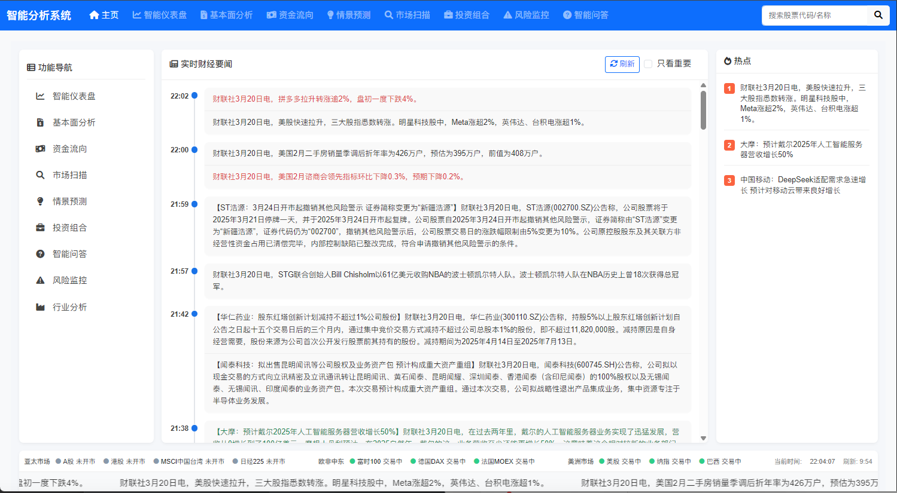

# 智能分析系统




## 📝 项目概述

智能分析系统是一个基于Python和Flask的Web应用，整合了多维度股票分析能力和人工智能辅助决策功能。系统通过AKShare获取股票数据，结合技术分析、基本面分析和资金面分析，为投资者提供全方位的投资决策支持。

## ✨ 核心功能

### 多维度股票分析

- **技术面分析**：趋势识别、支撑压力位、技术指标（RSI、MACD、KDJ等）
- **基本面分析**：估值分析、财务健康、成长前景
- **资金面分析**：主力资金流向、北向资金、机构持仓
- **智能评分**：100分制综合评分，40-40-20权重分配

### 智能化功能

- **AI增强分析**：通过AI API提供专业投资建议
- **支撑压力位自动识别**：智能识别关键价格区域
- **情景预测**：生成乐观、中性、悲观多种市场情景，优化预测精度和可视化效果
- **智能问答**：支持联网搜索实时信息和多轮对话，回答关于个股的专业问题

### 市场分析工具

- **市场扫描**：筛选高评分股票，发现投资机会
- **投资组合分析**：评估投资组合表现，提供调整建议
- **风险监控**：多维度风险预警系统
- **指数和行业分析**：支持沪深300、中证500等指数和主要行业成分股分析

### 可视化界面

- **交互式图表**：K线图、技术指标、多维度评分雷达图
- **直观数据展示**：支撑压力位、评分、投资建议等清晰呈现
- **响应式设计**：适配桌面和移动设备的界面
- **财经门户主页**：三栏式财经门户风格布局，左侧功能导航、中间实时财经要闻、右侧舆情热点，底部显示全球主要市场状态

### 实时数据更新

- **实时财经要闻**：时间线形式展示最新财经新闻，自动高亮上涨/下跌相关内容
- **舆情热点监控**：自动识别和展示市场舆情热点，包括人工智能等前沿领域
- **全球市场状态**：实时显示亚太、欧非中东、美洲等全球主要证券市场的开闭市状态
- **自动刷新机制**：系统每10分钟自动刷新，确保数据实时性

## 🔧 系统架构

```
智能分析系统/
│
├── web_server.py            # Web服务器和路由控制
├── stock_analyzer.py        # 股票分析核心引擎
├── us_stock_service.py      # 美股服务（可选）
├── start.sh                 # 服务管理脚本
├── news_fetcher.py          # 新闻获取与缓存
├── stock_qa.py              # 智能问答功能，支持联网搜索
│
├── templates/               # HTML模板
│   ├── layout.html          # 基础布局模板
│   ├── index.html           # 首页（财经门户风格）
│   ├── dashboard.html       # 智能仪表盘
│   ├── stock_detail.html    # 股票详情页
│   ├── market_scan.html     # 市场扫描页面
│   ├── portfolio.html       # 投资组合页面
│   └── error.html           # 错误页面
│   └── *********            # 不一一列举了
│
├── static/                  # 静态资源
│   ├── favicon.ico          # favicon.ico
│   └── swagger.json         # API文档
│
├── data/                    # 数据存储目录
│   └── news/                # 新闻缓存目录
│
└── .env                     # 环境变量配置文件
```

### 技术栈

- **后端**：Python, Flask, AKShare, AI API
- **前端**：HTML5, CSS3, JavaScript, Bootstrap 5, ApexCharts
- **数据分析**：Pandas, NumPy
- **AI**：各种AI模型集成

## 📦 安装指南

### 环境要求

- Python 3.7+
- pip包管理器
- 网络连接（用于获取股票数据和访问AI API）

### 安装步骤

1. **克隆或下载代码库**

```bash
git clone https://github.com/LargeCupPanda/StockAnal_Sys.git
cd StockAnal_Sys
```

2. **安装依赖**

```bash
pip install -r requirements.txt
```

或手动安装主要依赖：

```bash
pip install flask pandas numpy akshare requests matplotlib python-dotenv flask-cors flask-caching
```

3. **创建并配置环境变量**

将`.env-example`复制为`.env`，并设置您的API密钥：

```
# API 提供商 (OpenAI SDK )
API_PROVIDER=openai

# OpenAI API 配置
OPENAI_API_URL=***
OPENAI_API_KEY=your_api_key
OPENAI_API_MODEL=gpt-4o
NEWS_MODEL=你的可联网模型
```

## ⚙️ 配置说明

### 环境变量

| 变量名 | 说明 | 默认值 |
|-------|------|-------|
| `API_PROVIDER` | API提供商选择 | `openai` |
| `OPENAI_API_KEY` | OpenAI API密钥 | 无，必须提供 |
| `OPENAI_API_URL` | OpenAI API端点URL | `https://api.openai.com/v1` |
| `OPENAI_API_MODEL` | 使用的OpenAI模型 | `gpt-4o` |
| `PORT` | Web服务器端口 | `8888` |

### 技术指标参数

可在`stock_analyzer.py`中的`__init__`方法中调整以下参数：

- `ma_periods`: 移动平均线周期设置
- `rsi_period`: RSI指标周期
- `bollinger_period`: 布林带周期
- `bollinger_std`: 布林带标准差
- `volume_ma_period`: 成交量均线周期
- `atr_period`: ATR周期

### 缓存机制

系统实现了智能缓存策略，包括：

- **股票数据缓存**：减少重复API调用
- **分析结果缓存**：避免重复计算
- **任务结果缓存**：保存已完成任务的结果
- **新闻数据缓存**：按天存储新闻数据，避免重复内容
- **自动缓存清理**：每天收盘时间(16:30左右)自动清理所有缓存，确保数据实时性

## 🚀 使用指南

### 启动系统

使用提供的启动脚本：

```bash
bash start.sh start
```

启动后，访问 `http://localhost:8888` 打开系统。

### 其他管理命令

```bash
bash start.sh stop       # 停止服务
bash start.sh restart    # 重启服务
bash start.sh status     # 查看服务状态
bash start.sh monitor    # 以监控模式运行（自动重启）
bash start.sh logs       # 查看日志
```

### Docker启动

```bash
docker-compose up -d
```
可以挂载sqlite_data，在env文件中设置USE_DATABASE=True
可以使用redis缓存，在env文件中设置USE_REDIS_CACHE=True
挂载.env文件到本地

### 主要功能页面

1. **首页** (`/`)
   - 三栏式财经门户风格界面
   - 左侧功能导航、中间实时财经要闻、右侧舆情热点
   - 底部显示全球主要市场状态，10分钟自动刷新

2. **智能仪表盘** (`/dashboard`)
   - 输入股票代码，开始分析
   - 查看多维度分析结果和AI建议

3. **股票详情** (`/stock_detail/<stock_code>`)
   - 查看单只股票的详细分析
   - 支持技术图表、支撑压力位和AI分析

4. **市场扫描** (`/market_scan`)
   - 扫描指数成分股或行业股票
   - 筛选高评分股票，发现投资机会

5. **投资组合** (`/portfolio`)
   - 创建和管理个人投资组合
   - 分析组合表现，获取优化建议

6. **基本面分析** (`/fundamental`)
   - 查看股票财务指标和估值分析
   - 分析股票成长性和财务健康状况

7. **资金流向** (`/capital_flow`)
   - 跟踪主力资金和北向资金动向
   - 分析机构持仓变化

8. **情景预测** (`/scenario_predict`)
   - 预测股票未来走势的多种情景
   - 提供乐观、中性、悲观三种预测

9. **风险监控** (`/risk_monitor`)
   - 分析股票和投资组合风险
   - 提供风险预警和应对建议

10. **智能问答** (`/qa`)
    - 通过AI回答关于股票的专业问题
    - 支持联网搜索实时信息和多轮对话

11. **行业分析** (`/industry_analysis`)
    - 分析行业整体表现和资金流向
    - 对比不同行业投资机会

### 常用操作

- **分析股票**：在智能仪表盘输入股票代码，点击"分析"
- **查看股票详情**：点击股票代码或搜索股票进入详情页
- **扫描市场**：在市场扫描页面选择指数或行业，设置最低评分，点击"扫描"
- **管理投资组合**：在投资组合页面添加/删除股票，查看组合分析
- **智能问答**：选择股票后，提问关于该股票的问题，获取AI回答
- **查看实时财经要闻**：在首页浏览最新财经新闻和舆情热点

## 📚 API文档

系统提供了完整的REST API，可通过Swagger文档查看：`/api/docs`

主要API包括：

- 股票分析API：`/api/enhanced_analysis`
- 市场扫描API：`/api/start_market_scan`
- 指数成分股API：`/api/index_stocks`
- 智能问答API：`/api/qa`
- 风险分析API：`/api/risk_analysis`
- 情景预测API：`/api/scenario_predict`
- 行业分析API：`/api/industry_analysis`
- 最新新闻API：`/api/latest_news`

## 📋 版本历史

### v2.1.0 (当前版本)
- 优化缓存机制，增加市场收盘时自动清理缓存
- 增强错误处理和系统稳定性
- 新增智能问答功能，支持联网搜索实时信息和多轮对话
- 优化情景预测模块，提高预测精度和可视化效果
- 新增行业分析功能
- 改进首页为财经门户风格，实时显示财经要闻与舆情热点
- 增加全球主要市场状态实时监控
- 优化服务器超时处理
- 改进UI交互体验

### v2.0.0
- 增加多维度分析能力
- 整合AI API实现AI增强分析
- 新增投资组合管理功能
- 重构用户界面，添加交互式图表
- 优化技术分析和评分系统

### v1.0.0 (初始版本)
- 基础股票分析功能
- 技术指标计算
- 简单评分系统
- 基础Web界面

## 🔄 扩展开发

系统设计采用模块化架构，便于扩展开发。主要扩展点包括：

- 添加新的技术指标
- 集成其他数据源
- 开发新的分析模块
- 扩展用户界面功能

## ⚠️ 注意

**当前版本为先驱探索版，旨在学习人工智能在指令分析方面的研究学习。AI生成的内容有很多错误，请勿当成投资建议，若由此造成的一切损失，本项目不负责！**

## 💡 联系与支持

如有问题或建议，请pr：

- 项目有很多问题，基础功能可以运行起来，扩充项目代码全由AI开发，所以进展比较缓慢，请谅解。
- 如你有好的想法或修复，欢迎提交GitHub Issue

感谢使用智能分析系统！